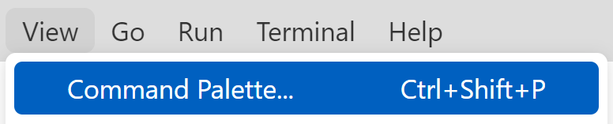
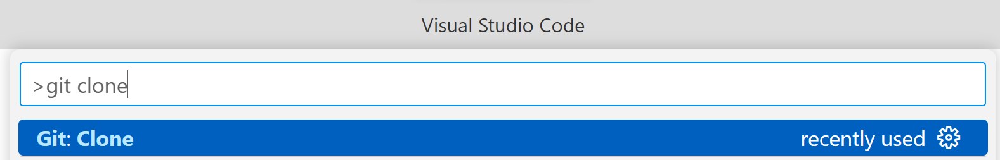
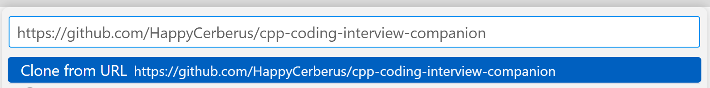
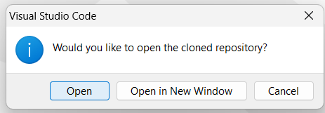
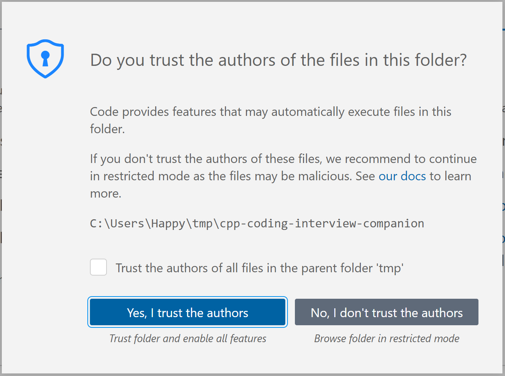
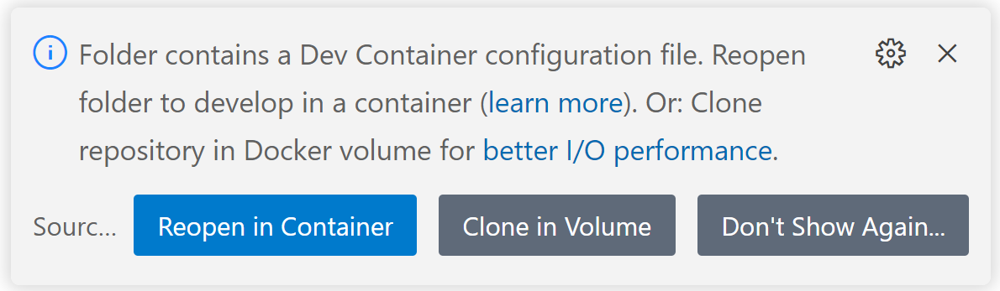

{full: true, community: true}
# Introduction

## Book structure

I believe in interleaving theory and practical training, and I have structured this book to facilitate and enrich this workflow. Each chapter adheres to a consistent structure to ensure a steady progression.

We start with an introduction that covers relevant C++ background as necessary. Then, we move on to essential patterns and simple operations. Each chapter concludes with carefully selected problems, complemented by solutions and commentary.

While the chapters are sequential, with each building on the foundations of the previous, the book doesn't restrict you to strict reading order. Instead, it comes with a comprehensive index. You can always refer to the index to look up more details if you encounter an unfamiliar concept or algorithm.

## Companion repository

This book has a companion repository with a test suite and scaffolding for each problem.

The repository is set up with a DevContainer configuration. It allows for a seamless C++ development environment, equipped with the latest stable versions of GCC, GDB, and Clang when accessed through VS Code. All you need to take full advantage of this are [Visual Studio Code](https://code.visualstudio.com/download) and [Docker](https://www.docker.com/products/docker-desktop/).

To get up and running, follow these steps:

1. Open Visual Studio Code, and select View>Command Palette. 
2. Write in "git clone" and select the "Git: Clone" action. 
3. Paste in the companion repository URL: "https://github.com/HappyCerberus/cpp-coding-interview-companion" and confirm. 
4. Visual Studio Code will ask for a location and, once done, will ask to open the cloned repository. Confirm. 
5. Visual Studio Code will now ask whether you trust me. Confirm that you do. You can see all the relevant configuration inside the repository in the `.vscode` and `.devcontainer` directories. 
6. Finally, Visual Studio Code will detect the devcontainer configuration and ask whether you want to re-open the project in the devcontainer. Confirm. After VSCode downloads the container, you will have a fully working C++ development environment with the latest GCC, Clang, GDB, and Bazel. 

## Using this book

The process you employ to solve the problems presented in this book is essential. Typically, in a coding interview, you vocalize your thoughts to allow for feedback and guidance. However, while using this book, that instant interaction isn't available. Should you find yourself stuck, consider this strategy:

First, ensure you grasp the problem at hand. Then, try sketching it out or examining some examples on paper.

Next, see if you can implement a simple brute-force solution as a starting point. From there, ask yourself what could be optimized. Is there repeated work? Can one solution inform another?

If you're genuinely stumped, the hints section could offer valuable insight. It begins by outlining the tools or approaches that might be useful and then provides more detailed suggestions.